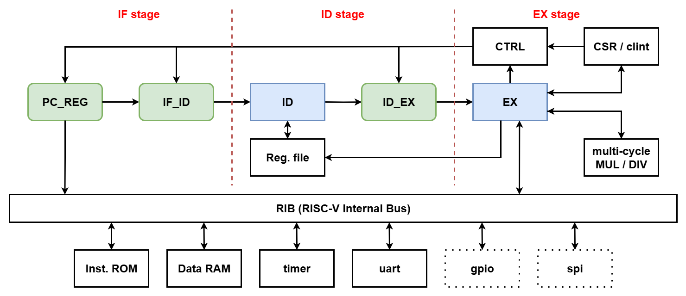

# 3-Stage RV32IM Pipeline RISC-V CPU

This project implements a modular **3-Stage Pipeline RV32IM RISC-V CPU
(Verilog HDL)**, with automated verification for ISA, CSR, trap, interrupt, and
imported compliance behavior.


## Table of Contents
- [Repository Layout](#repository-layout)
- [Architecture](#architecture)
  - [3-Stage Pipeline](#3-stage-pipeline)
  - [System Organization](#system-organization)
- [Implementation Status](#implementation-status)
  - [Future Work](#future-work)
- [Simulation & Verification](#simulation--verification)
  - [Test Result Summary](#test-result-summary)
- [References](#references)


## Repository Layout
```text
rtl/
  core/                 # Pipeline core, CSR, CLINT, RIB, and pipeline control
  perips/               # inst_rom, data_ram, timer, uart
  soc/                  # SoC wrapper
  utils/                # Shared definitions and utility registers

sim/
  compile_and_sim.py    # Compile and run simulation
  isa_test/             # RV32I / RV32M regression runners and binaries
  csr_test/             # CSR / trap / interrupt regression runner and binaries
  compliance_test/      # Compliance runner and local generated data

tb/
  tb.v                  # Top-level testbench

img/
  Arichtecture-core.drawio.png
  Arichtecture.drawio
```

<br>

## Architecture
The processor is a modular 3-stage pipeline core with a small simulation SoC.


### 3-Stage Pipeline
```text
IF -> ID -> EX
```

| Stage | Description |
|-------|-------------|
| IF | Instruction Fetch |
| ID | Instruction Decode / Register Read |
| EX | Execute / Memory / CSR / Write Back |


### System Organization


The diagram shows the 3-stage core, RIB, and current SoC peripherals. The Core
handles instruction flow, execution, CSR/trap control, MUL/DIV, and memory
access. The RIB routes instruction fetch and load/store requests to `inst_rom`,
`data_ram`, `timer`, and `uart`; load/store access has priority over
instruction fetch.

Current memory access regions:

| Region | Address Range | Description |
|--------|---------------|-------------|
| `inst_rom` | IF path from `0x0000_0000` | Instruction fetch target |
| `data_ram` | MEM path from `0x0000_0000` | Load/store data memory |
| `timer` | MEM path from `0x2000_0000` | MMIO timer with interrupt output |
| `uart` | MEM path from `0x3000_0000` | MMIO UART TX/RX |

The SoC also exposes an external interrupt input and UART RX/TX pins.

<br>

## Implementation Status

### Timeline View

| Completed On | Category | Item | Status | Note |
|--------------|----------|------|--------|------|
| 2026-01-21 | Core | 3-stage pipeline structure | Done | IF / ID / EX architecture organization |
| 2026-02-04 | ISA | RV32I base instructions | Done | Integer, branch/jump, load/store, write-back |
| 2026-02-10 | ISA | RV32M extension | Done | RV32M instruction decode / execute support |
| 2026-03-03 | ISA | RV32M multi-cycle MUL | Done | `MUL`, `MULH`, `MULHSU`, `MULHU` |
| 2026-05-19 | ISA | RV32M multi-cycle DIV | Done | `DIV`, `DIVU`, `REM`, `REMU` |
| 2026-05-19 | Pipeline Control | Forwarding, load-use bubble | Done | - |
| 2026-06-18 | Interrupt / CSR | Machine CSR, trap, `mret`, MEI | Done | Machine-mode subset |
| 2026-06-22 | Verification | ISA regression | Done | RV32I / RV32M regression tests |
| 2026-06-22 | Verification | CSR regression | Done | - |
| 2026-06-22 | Verification | Architecture compliance tests | Done | ACT4 tests compared against Sail golden signatures |
| 2026-07-23 | RIB / MMIO | Timer MMIO slave | Done | Zero-wait RIB slave at `0x2000_0000` |
| 2026-07-24 | Interrupt / CSR | Timer interrupt | Done | Timer MTIP / MTIE through CSR and CLINT |
| 2026-07-24 | RIB / MMIO | RIB grant / MMIO decode | Done | MEM has priority over IF, zero-wait read path kept |
| 2026-07-28 | Peripheral | UART TX/RX | Done | TX/RX FSM and register map |
| 2026-07-29 | RIB / MMIO | UART MMIO slave | Done | MMIO slave at `0x3000_0000` |
| - | Privileged | Privileged architecture | Partial | Machine-mode subset only |
| - | RIB / MMIO | RIB expansion | Ongoing | Reserved slots remain for GPIO/SPI/debug expansion |

### Future Work

| Item | Status | Note |
|------|--------|------|
| Vectored `mtvec` | Not Implemented | Optional trap mode |
| GPIO/SPI MMIO | Not Implemented | Future RIB peripherals |
| UART interrupt / FIFO | Not Implemented | Future UART extensions |

<br>

## Simulation & Verification
The design is validated through Python-driven Icarus Verilog regression tests.
See [sim/README.md](sim/README.md) for the ISA, CSR, and ACT4/Sail compliance
flows.


### Test Result Summary
| Category | Coverage | Status | Note |
|----------|----------|--------|------|
| ISA regression | RV32I/RV32M, load/store, branch/jump | Pass | `fence_i` is a known gap |
| Hazard handling | Forwarding, load-use bubble | Pass | - |
| CSR/trap regression | CSR ops, exceptions, `mret` | Pass | - |
| Interrupt handling | External interrupt and timer interrupt | Pass | MEI + MTI machine-mode subset |
| ACT4/Sail compliance | Golden signature comparison | Pass | Local golden files |

Generated files such as `sim/inst_data.txt`, `sim/out.vvp`, waveform files,
Python cache files, and compliance runtime/golden folders are not part of the
source code.

<br>

## References

### Specifications

- [RISC-V GitHub Organization](https://github.com/riscv) - Official RISC-V specifications and architecture test resources.
- [RISC-V ISA Manual](https://github.com/riscv/riscv-isa-manual) - RISC-V unprivileged and privileged architecture manuals.
- [RISC-V Architecture Tests](https://github.com/riscv-non-isa/riscv-arch-test) - Official architecture compliance test suite.

### Reference Projects

- [SI-RISCV Project](https://github.com/SI-RISCV/e200_opensource) - Reference open-source RISC-V core project.
- [TinyRISC-V](https://gitee.com/liangkangnan/tinyriscv) - Small RV32IM core used as a practical reference for RIB and peripherals.
